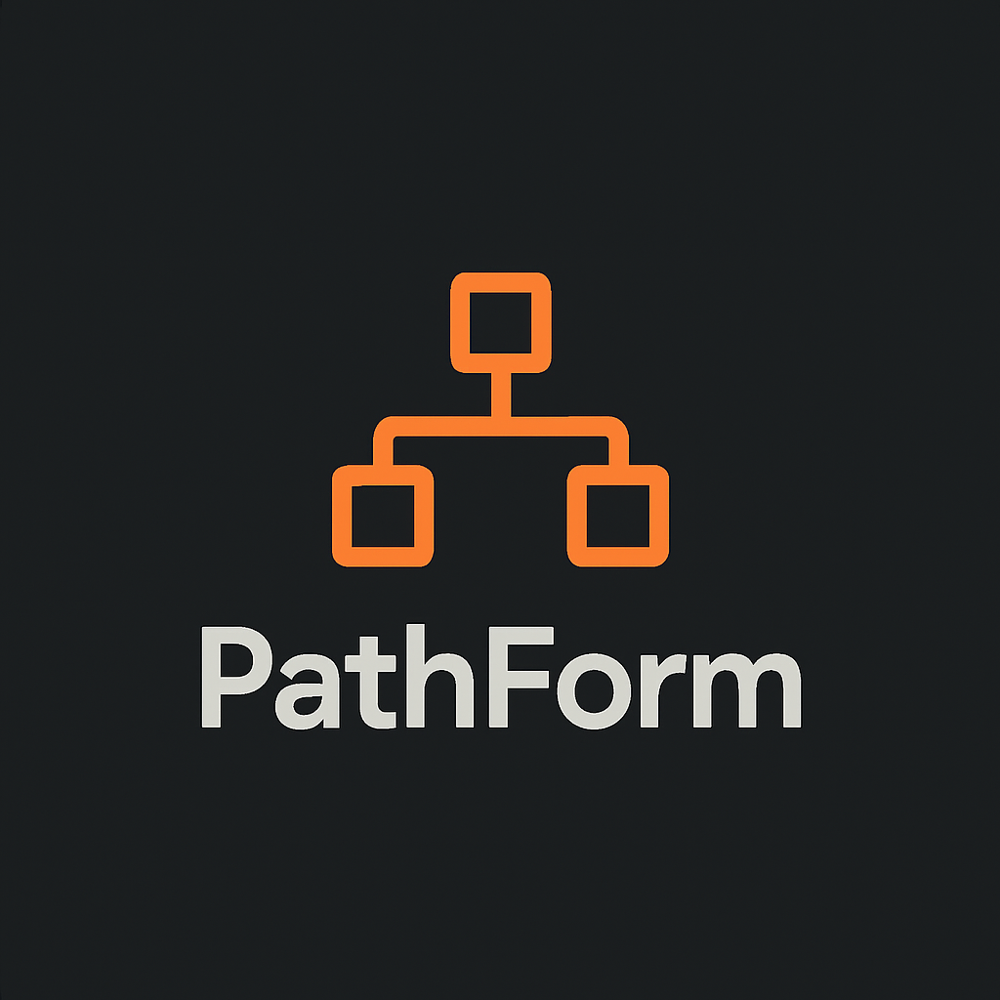

<div align="center">
  
  
  # PathForm
  
  **A token-cheap, LLM-friendly text format that round-trips cleanly to JSON**
  
  [](https://github.com/makalin/pathform/actions)
  [](https://opensource.org/licenses/MIT)
</div>

---

PathForm is a token-cheap, LLM-friendly text format that round-trips cleanly to JSON.

- One fact per line
- `path = value` syntax
- `.` for nesting, `[index]` for arrays
- Minimal punctuation, easy for LLMs to generate, trivial to parse

Ideal for:
- Agent configs and tool calls
- Internal reasoning traces
- Prompt-embedded structured data that must map to JSON

---

## Why PathForm?

JSON is great for interoperability, but:

- Heavy punctuation (`{ } [ ] , " :`)
- Repeated keys increase token usage
- Strict syntax causes frequent LLM errors

PathForm keeps the *structure* of JSON but encodes it as simple lines that LLMs handle more reliably and cheaply.

---

## Core Syntax

### Line types

```text
<line> = <statement> | <comment> | <blank>
````

* **Statement**: `path = value`
* **Comment**: starts with `#`
* **Blank**: empty or whitespace-only

Examples:

```text
# This is a comment
user.name = "Mehmet"
user.age = 49

# blank line above is allowed
```

---

### Paths

```text
<path> = <segment> ( "." <segment> | <index> )*

<segment> = [a-zA-Z_][a-zA-Z0-9_]*
<index>   = "[" <non-negative-integer> "]"
```

Examples:

```text
user.name
user.address.city
items[0]
items[3].price
config.models[1].name
```

Semantics:

* `.` → nested objects
* `[n]` → array element at index `n` (0-based)

---

### Values

Supported value types:

* `number`   → JSON number
* `true`     → JSON boolean `true`
* `false`    → JSON boolean `false`
* `null`     → JSON `null`
* `string`   → JSON string

Rules:

1. **Booleans / null**

   ```text
   is_active = true
   is_beta   = false
   note      = null
   ```

2. **Numbers**

   Any valid JSON number:

   ```text
   speed_kmh      = 47
   temperature    = -3.5
   probability    = 0.82
   learning_rate  = 1e-4
   ```

3. **Strings**

   * If no spaces and no special chars: bare token

     ```text
     lang  = tr
     role  = system
     model = gpt-5.1
     ```

   * If value needs spaces or special chars: use JSON-style quoted string

     ```text
     message = "Maintain 45 km/h to hit the next green wave"
     hint    = "Don't exceed 70 km/h"
     ```

   * Inside quotes, escaping follows JSON rules (e.g. `\"`, `\\`, `\n`).

---

## JSON Mapping

PathForm describes a virtual JSON object. The algorithm:

* Start with empty JSON object: `{}`
* For each statement `path = value`:

  * Walk/allocate objects and arrays according to the path
  * Set the final slot to the parsed value

Example:

```text
task.id = "gwave_001"
task.type = summarize
task.lang = tr

input.user_id = 12345
input.city = "Istanbul"
input.speed_kmh = 47
input.distance_to_light_m = 230

constraints[0] = "Driver-friendly language"
constraints[1] = "Do not mention this is generated by AI"
constraints[2] = "Max 2 short sentences"
```

Equivalent JSON:

```json
{
  "task": {
    "id": "gwave_001",
    "type": "summarize",
    "lang": "tr"
  },
  "input": {
    "user_id": 12345,
    "city": "Istanbul",
    "speed_kmh": 47,
    "distance_to_light_m": 230
  },
  "constraints": [
    "Driver-friendly language",
    "Do not mention this is generated by AI",
    "Max 2 short sentences"
  ]
}
```

---

## LLM Prompt Usage

### Simple instruction to the model

```text
You must respond ONLY in PathForm (no prose, no JSON, no explanations).

Rules:
- One statement per line: path = value
- Use "." for nested objects (e.g. output.summary)
- Use "[index]" for arrays (e.g. constraints[0])
- Use quotes only when value has spaces

Define a task:

- task.id: string
- task.type: one of {summarize, route_plan, warning}
- task.lang: language code (e.g. "tr")
- input.*: information about the current traffic situation
- constraints[]: list of short rules
- output.*: structure of model output

Example:

task.id = "example_1"
task.type = summarize
task.lang = en
constraints[0] = "Max 1 sentence"

Now fill for the current situation:
```

The model’s response is already machine-parseable and ready to become JSON.

---

## Example: Green Wave Advisor Config

**PathForm:**

```text
# Metadata
task.id = "green_wave_istanbul_001"
task.type = route_plan
task.lang = tr

# Driver / context
driver.id = 987654
driver.experience_level = "intermediate"

city.name = "Istanbul"
city.zone = "Kadikoy"
city.country = "TR"

# Sensor-like inputs
input.current_speed_kmh = 43
input.distance_to_next_light_m = 250
input.next_light_state = green
input.next_light_time_to_change_sec = 18

# Model config
model.name = gpt-5.1
model.temperature = 0.1
model.max_tokens = 256

# Constraints
constraints[0] = "Use friendly, non-technical Turkish"
constraints[1] = "Max 2 short sentences"
constraints[2] = "Recommend safe and legal speeds only"

# Output hints
output.type = object
output.fields[0].name = "advice"
output.fields[0].type = "string"
output.fields[1].name = "recommended_speed_kmh"
output.fields[1].type = "number"
output.fields[2].name = "justification"
output.fields[2].type = "string"
```

---

## Round-tripping to PathForm

PathForm → JSON is defined above. JSON → PathForm can be implemented by recursively walking the JSON object and emitting `path = value` lines:

* Root object starts with empty prefix
* For object keys: `prefix + "." + key` (or just `key` if no prefix)
* For arrays: `prefix + "[" + index + "]"`

You can choose between:

* **Flat mode**: All paths are fully qualified
* **Grouped mode**: Same as flat, but sorted/grouped by prefixes for readability

---

## Features

✨ **Multi-language Support** - Parsers available in Python, JavaScript, TypeScript, Go, and Rust  
🚀 **CLI Tools** - Command-line utilities for conversion and validation  
🔧 **Developer Tools** - Validator, formatter, diff tool, and benchmark utilities  
📦 **Package Ready** - Available via npm, PyPI, Go modules, and Cargo  
✅ **Well Tested** - Comprehensive test suites for all implementations  
🔄 **Round-trip** - Perfect conversion between PathForm and JSON  
📚 **Well Documented** - Complete documentation with examples and integration guides  

---

## Quick Start

```bash
# Python
pip install -e .
python -c "from pathform import parse_pathform; print(parse_pathform('user.name = \"Mehmet\"'))"

# Node.js
npm install
node -e "const {parsePathform} = require('./pathform.js'); console.log(parsePathform('user.name = \"Mehmet\"'))"

# Go
go get github.com/makalin/pathform

# Rust
cargo build --release
```

See [QUICKSTART.md](QUICKSTART.md) for a 5-minute getting started guide.

---

## Installation

### Python
```bash
pip install -e .
# or
python setup.py install
```

### Node.js
```bash
npm install
# or
npm install -g .
```

### Go
```bash
go get github.com/makalin/pathform
```

### Rust
```bash
cargo build --release
```

---

## CLI Tools

### pathform2json
Convert PathForm files to JSON:

```bash
# Python
pathform2json input.pf > output.json
pathform2json input.pf -o output.json --indent 4

# Node.js
node pathform2json.js input.pf > output.json

# Go
go run pathform2json.go input.pf > output.json
```

### json2pathform
Convert JSON files to PathForm:

```bash
# Python
json2pathform input.json > output.pf
json2pathform input.json --flat

# Node.js
node json2pathform.js input.json > output.pf

# Go
go run json2pathform.go input.json > output.pf
```

### Additional Developer Tools

#### Validation
```bash
# Validate PathForm syntax
pathform_validator.py file.pf
pathform_validator.py --strict *.pf  # Exit on errors
```

#### Formatting
```bash
# Format PathForm files
pathform_formatter.py file.pf -i  # In-place formatting
pathform_formatter.py file.pf --indent "    "  # Custom indent
pathform_formatter.py file.pf --no-sort  # Don't sort paths
```

#### Diff Tool
```bash
# Compare two PathForm files
pathform_diff.py file1.pf file2.pf
```

#### Benchmarking
```bash
# Performance benchmarking
python benchmark.py --iterations 1000
```

---

## Usage Examples

### Python
```python
from pathform import parse_pathform, from_json, to_json

# Parse PathForm
text = """
user.name = "Mehmet"
user.age = 49
"""
data = parse_pathform(text)

# Convert to JSON
json_str = to_json(text)

# Convert from JSON
pathform = from_json(data)
```

### JavaScript/Node.js
```javascript
const { parsePathform, fromJSON, toJSON } = require('./pathform.js');

// Parse PathForm
const text = `
user.name = "Mehmet"
user.age = 49
`;
const data = parsePathform(text);

// Convert to JSON
const jsonStr = toJSON(text);

// Convert from JSON
const pathform = fromJSON(data);
```

### Browser
```html
<script src="pathform.browser.js"></script>
<script>
  const data = PathForm.parse('user.name = "Mehmet"');
  const json = PathForm.toJSON('user.name = "Mehmet"');
</script>
```

### TypeScript
```typescript
import { parsePathform, fromJSON, toJSON } from './pathform';

const text = `
user.name = "Mehmet"
user.age = 49
`;

const data = parsePathform(text);
const jsonStr = toJSON(text);
const pathform = fromJSON(data);
```

### Go
```go
import "github.com/makalin/pathform"

// Parse PathForm
text := `user.name = "Mehmet"
user.age = 49`
data, err := pathform.ParsePathform(text)

// Convert to JSON
jsonStr, err := pathform.ToJSON(text, 2)

// Convert from JSON
pathformStr, err := pathform.FromJSON(data, false)
```

---

## Examples

Check out the `examples/` directory for real-world usage:

- **simple.pf** - Basic PathForm example
- **nested.pf** - Complex nested structures
- **green_wave.pf** - Real-world LLM configuration example
- **integration_python.py** - Python integration guide
- **integration_node.js** - Node.js integration guide

### Example: Simple Usage
```text
user.name = "Mehmet"
user.age = 49
user.preferences.theme = dark
items[0] = "first"
items[1] = "second"
```

### Example: LLM Configuration
```text
task.id = "task_001"
task.type = summarize
task.lang = tr
constraints[0] = "Max 2 sentences"
constraints[1] = "Use friendly language"
model.name = gpt-4
model.temperature = 0.7
```

---

## Development

### Running Tests
```bash
make test              # Run all tests
make test-python       # Python tests only
make test-js           # JavaScript tests only
make test-go           # Go tests only
```

### Building
```bash
make build             # Build all binaries
make install           # Install all packages
```

### Formatting & Linting
```bash
make format            # Format all code
make lint              # Lint all code
```

### Project Structure
```
PathForm/
├── pathform.py              # Python parser
├── pathform.js              # Node.js parser
├── pathform.browser.js      # Browser parser
├── pathform.ts              # TypeScript parser
├── pathform.go              # Go parser
├── pathform.rs              # Rust parser
├── pathform2json.*          # CLI: PathForm → JSON
├── json2pathform.*          # CLI: JSON → PathForm
├── pathform_validator.py    # Validation tool
├── pathform_formatter.py    # Formatting tool
├── pathform_diff.py         # Diff tool
├── benchmark.py             # Performance tool
├── test/                    # Test suites
├── examples/                # Example files
└── docs/                    # Documentation
```

---

## Contributing

We welcome contributions! Please see [CONTRIBUTING.md](CONTRIBUTING.md) for guidelines.

- 🐛 Found a bug? [Open an issue](https://github.com/makalin/pathform/issues)
- 💡 Have an idea? [Start a discussion](https://github.com/makalin/pathform/discussions)
- 🔧 Want to contribute? [Read the guide](CONTRIBUTING.md)

---

## Status & Roadmap

### ✅ Completed

- ✅ Basic spec: paths, values, comments
- ✅ Clear JSON mapping
- ✅ Reference parsers (Python, JavaScript, TypeScript, Go, Rust)
- ✅ CLI tools (`pathform2json`, `json2pathform`)
- ✅ Developer tools (validator, formatter, diff, benchmark)
- ✅ Package configurations (npm, PyPI, Go modules, Cargo)
- ✅ Comprehensive test suites
- ✅ CI/CD with GitHub Actions
- ✅ Complete documentation and examples
- ✅ TypeScript type definitions
- ✅ Browser-compatible build

### 🚧 In Progress / Planned

- ⏳ Additional language implementations (Java, C#, Ruby, PHP, etc.)
- ⏳ Language server protocol (LSP) support
- ⏳ Editor plugins (VSCode, Vim, Emacs, etc.)
- ⏳ Syntax highlighting themes
- ⏳ Performance optimizations
- ⏳ Streaming parser for large files

---

## License

PathForm is licensed under the MIT License. See [LICENSE](LICENSE) for details.

## Credits

PathForm is created and maintained by **Mehmet T. AKALIN (makalin)**.  
Designed for modern LLM workflows, agent systems, and efficient prompt-embedded structured data.

Contributions and implementations in all languages are welcome!

## Related Projects

- Looking for a JSON alternative? Check out PathForm!
- Building LLM applications? PathForm is perfect for structured prompts
- Need a lightweight config format? PathForm has you covered

---

<div align="center">
  <strong>Made with ❤️ for the LLM community</strong>
</div>
